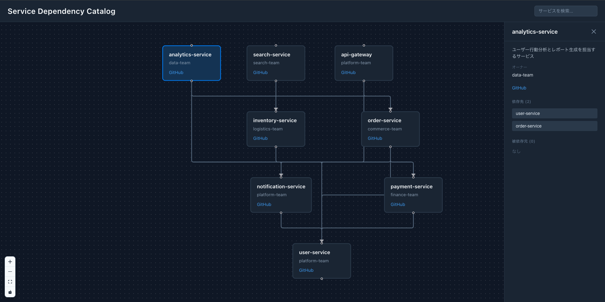

# Simple Service Catalog Kit

マイクロサービスの依存関係を可視化するシンプルなサービスカタログツール。



## 機能

- YAMLファイルベースのサービス定義
- 依存関係のグラフ可視化（React Flow）
- サービス詳細パネル
- 検索・フィルタリング機能
- 循環依存・未定義参照の警告表示

## 技術スタック

- **フロントエンド**: React 19 + TypeScript
- **ビルドツール**: Vite 7
- **グラフ可視化**: @xyflow/react (React Flow v12)
- **レイアウト**: dagre
- **テスト**: Vitest + Testing Library
- **リント/フォーマット**: Biome

## セットアップ

```bash
# 依存関係のインストール
pnpm install

# 開発サーバー起動
pnpm dev

# ビルド
pnpm build

# テスト実行
pnpm test

# リント・フォーマット
pnpm check
```

## サービス定義

`services/` フォルダにYAMLファイルを配置してサービスを定義します。

### フォーマット

```yaml
name: api-gateway
description: APIゲートウェイ - 全リクエストの入口
owner: platform-team
github: https://github.com/example/api-gateway
dependencies:
  - user-service
  - order-service
```

### 必須フィールド

| フィールド | 説明 |
|-----------|------|
| `name` | サービス名（英数字、ハイフン） |
| `description` | サービスの説明 |
| `owner` | オーナーチーム |
| `github` | GitHubリポジトリURL |
| `dependencies` | 依存サービス名の配列 |

## ディレクトリ構成

```
.
├── services/           # サービス定義YAMLファイル
├── src/
│   ├── components/     # Reactコンポーネント
│   │   ├── Detail/     # サービス詳細パネル
│   │   ├── Graph/      # グラフ可視化
│   │   └── Search/     # 検索バー
│   ├── hooks/          # カスタムフック
│   ├── types/          # TypeScript型定義
│   └── utils/          # ユーティリティ関数
└── tests/              # テストファイル
    ├── unit/           # ユニットテスト
    ├── integration/    # 統合テスト
    └── performance/    # パフォーマンステスト
```

## 使い方

1. アプリを起動すると、`services/` フォルダ内のYAMLファイルが自動的に読み込まれます
2. グラフ上でサービスノードをクリックすると詳細パネルが表示されます
3. 検索バーでサービス名・説明・オーナーでフィルタリングできます
4. 循環依存や未定義参照がある場合は警告が表示されます

## Jaegerからの自動生成

Jaegerのトレース情報からサービス定義YAMLを自動生成できます。

### 基本的な使い方

```bash
# Jaeger (localhost:16686) からサービス定義を生成
pnpm generate:jaeger

# カスタムJaeger URLを指定
pnpm generate:jaeger -- --jaeger-url http://jaeger.example.com:16686

# 確認モード（ファイルを作成せずに内容を確認）
pnpm generate:jaeger -- --dry-run
```

### オプション

| オプション | 説明 | デフォルト |
|-----------|------|-----------|
| `--jaeger-url <url>` | JaegerのURL | `http://localhost:16686` |
| `--output <dir>` | 出力先ディレクトリ | `./services` |
| `--owner <name>` | デフォルトのオーナー名 | `unknown-team` |
| `--dry-run` | ファイルを作成せずに確認 | - |

### OpenTelemetry Demoでの使用例

[OpenTelemetry Demo](https://github.com/open-telemetry/opentelemetry-demo)を使った例：

```bash
# OpenTelemetry Demoを起動
git clone https://github.com/open-telemetry/opentelemetry-demo.git
cd opentelemetry-demo
docker compose up -d

# 数分待ってトレースデータが蓄積されたら、サービス定義を生成
cd /path/to/simple-service-catalog-kit
pnpm generate:jaeger -- --jaeger-url http://localhost:57006/jaeger/ui

# 生成されたサービス定義を確認
pnpm dev
```

## Datadogからの自動生成

Datadog APMのサービス依存関係からYAMLを自動生成できます。

### 基本的な使い方

```bash
# 環境変数でAPIキーを設定
export DD_API_KEY="your-api-key"
export DD_APP_KEY="your-application-key"

# サービス定義を生成
pnpm generate:datadog -- --env production

# 確認モード
pnpm generate:datadog -- --env production --dry-run
```

### オプション

| オプション | 説明 | デフォルト |
|-----------|------|-----------|
| `--api-key <key>` | Datadog APIキー | 環境変数 `DD_API_KEY` |
| `--app-key <key>` | Datadog Application Key | 環境変数 `DD_APP_KEY` |
| `--site <site>` | Datadogサイト | `datadoghq.com` |
| `--env <env>` | APM環境（必須） | - |
| `--output <dir>` | 出力先ディレクトリ | `./services` |
| `--owner <name>` | デフォルトのオーナー名 | `unknown-team` |
| `--dry-run` | ファイルを作成せずに確認 | - |

### サポートするDatadogサイト

- `datadoghq.com` (US1)
- `datadoghq.eu` (EU)
- `us3.datadoghq.com` (US3)
- `us5.datadoghq.com` (US5)
- `ddog-gov.com` (US1-FED)

## S3へのデプロイ

このアプリはS3 + CloudFrontで静的ホスティングが可能です。

### ビルドと準備

```bash
# ビルド（自動的にindex.jsonが生成されます）
pnpm build

# 出力される dist/ フォルダの構成
dist/
├── index.html
├── assets/
│   ├── index-*.css
│   └── index-*.js
└── services/
    ├── index.json        # サービス一覧
    ├── api-gateway.yml   # 各サービス定義
    └── ...
```

### S3バケット設定

1. S3バケットを作成（静的ウェブサイトホスティングを有効化）
2. `dist/` フォルダの内容をバケットにアップロード
3. CloudFrontディストリビューションを作成（オプション、推奨）

### デプロイコマンド例

```bash
# AWS CLIでS3にデプロイ
aws s3 sync dist/ s3://your-bucket-name --delete

# CloudFrontのキャッシュを無効化
aws cloudfront create-invalidation \
  --distribution-id YOUR_DISTRIBUTION_ID \
  --paths "/*"
```

### サービス定義の更新

S3上のYAMLファイルを直接更新することで、アプリを再ビルドせずにサービス定義を更新できます。

```bash
# index.jsonのみ再生成
pnpm generate:index

# 新しいサービスファイルとindex.jsonをS3にアップロード
aws s3 sync services/ s3://your-bucket-name/services/
```

## ライセンス

MIT
